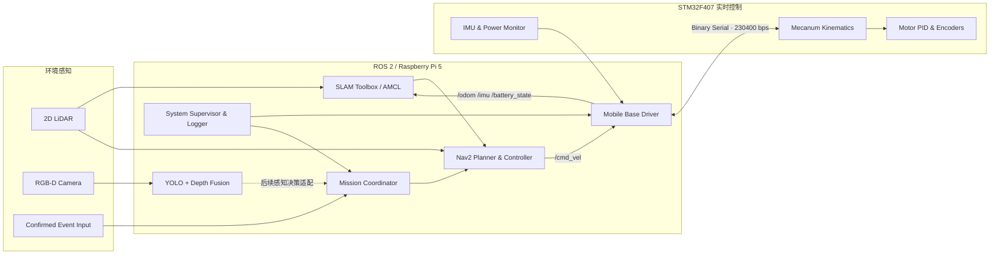

# 基于 ROS 2 的室内移动机器人应用原型

> Indoor Mobile Robot Application Research · Navigation / Perception / Mission / Safety

[](https://docs.ros.org/en/jazzy/)
[](https://www.raspberrypi.com/products/raspberry-pi-5/)
[](https://github.com/RenaissanceAIOT/indoor-evacuation-guidance-robot/actions/workflows/ci.yml)
[](LICENSE)

一个面向校园与公共建筑的室内移动机器人应用研究项目。系统以 ROS 2 为软件骨架，在实验室既有的自主导航、人机交互与智能疏散研究方向上，进一步研究机器人如何从单项算法验证走向可运行的楼宇应用：完成环境建图、稳定定位、动态避障、人员感知、出口选择、声光引导、任务记录与故障降级。

项目研究工作开展于亚洲大学 CAD/CAM 研究室与 KITECH 产学研合作背景下，仓库呈现的是个人负责的系统设计、工程实现与未来应用验证，不代表学校、研究室或合作机构的正式产品发布。

研究经历周期为 **2025.11—2026.02**；本仓库为 **2026.10 公开工程整理版**。主线是通用室内机器人系统集成，逃生引导是承接实验室研究方向的一个应用验证场景。当前发布包含源代码、配置与受控场景方案，不附带实机性能结论；历史经历、参数基线与本次代码补充的边界见 [证据与版本说明](docs/EVIDENCE.md)。

**阅读入口：** [项目报告：背景与实现](docs/PROJECT_REPORT.md) · [系统架构与接口](docs/ARCHITECTURE.md) · [可复现演示](docs/DEMO.md) · [验证记录与边界](docs/VALIDATION.md)

已提供串口协议、运动学 mock、视觉节点、Nav2 接入配置、出口任务状态机和故障联锁代码；未提供板级固件、真实楼宇实验数据或端到端视觉抓取。疏散场景用于验证通用平台的任务编排能力，不替代消防系统。

## 1. 应用场景

目标场景是一栋具有走廊、门厅、实验室和多个安全出口的教学科研建筑。

机器人平时作为室内移动研究平台执行地图维护、路线巡检与目标观察；收到经过确认的建筑事件后，切换到引导模式：

1. 获取当前位置、可用出口、通道风险与拥堵信息；
2. 选择综合代价最低且未封锁的出口；
3. 通过 Nav2 生成路径并在行人、推车等动态障碍之间安全移动；
4. 使用灯光、蜂鸣器和机体运动提供持续方向提示；
5. 当前出口失效时取消目标并重新选择；
6. 无可用出口、未获得定位、底盘通信中断或电量不足时取消任务并请求人工接管；
7. 全程记录任务状态、健康信息和关键事件，供实验复盘。

这是一套研究级应用系统，不是消防认证设备，也不使用摄像头单独判定火情。警情输入必须来自经过确认的外部系统或实验控制端。

## 2. 项目贡献

### 系统架构

- 建立 Raspberry Pi 5 与 STM32F407 的双层控制架构；
- 将导航、感知、任务管理与实时电机控制解耦；
- 定义 `map → odom → base_link → sensor` 坐标树和标准 ROS 2 接口；
- 将底盘、激光雷达、RGB-D 相机和六自由度机械臂组织为统一系统。

### 底盘与状态估计

- 实现双帧头、长度、功能码、大端 int16 与累加校验组成的二进制串口协议；
- 将 `/cmd_vel` 转换为 230400 bps 速度控制帧；
- 以 50 Hz 解析三轴加速度、三轴角速度、`vx/vy/wz` 与电池电压；
- 处理半帧、粘包、噪声和错误校验后的重新同步；
- 实现速度指令看门狗、诊断信息、里程计积分和 EKF 融合接口。

### 导航与感知

- 使用 SLAM Toolbox 完成二维建图；
- 使用 AMCL 全向运动模型与 Nav2 完成定位、规划和动态避障；
- 使用 YOLO 与对齐深度图完成目标检测和相机坐标系三维定位；
- 提供颜色目标、巡线和手势交互节点，支持后续行为实验。

### 应用任务

- 实现 `IDLE → SELECTING_EXIT → GUIDING → ARRIVED/BLOCKED/FAULT` 状态机；
- 使用距离、风险和拥堵权重选择出口；
- 支持出口动态封锁、导航失败重试和备用出口切换；
- 增加系统健康监控、任务 JSONL 日志、声光引导与安全降级。

## 3. 系统架构



## 4. 技术基线

| 子系统 | 设计与接口基线 | 在系统中的作用 |
| --- | --- | --- |
| 上位计算 | Raspberry Pi 5，Ubuntu 24.04，ROS 2 Jazzy | 导航、视觉、任务和日志 |
| 实时控制 | STM32F407VET6，168 MHz，512 KB Flash，192 KB SRAM | 运动学、电机闭环与采样 |
| 移动机构 | 四轮麦克纳姆全向底盘 | `x/y/yaw` 平面运动 |
| 驱动电机 | 12 V 编码器减速电机，1:30，额定 290±20 rpm，额定扭矩 1.5 kg·cm | 四轮独立速度控制 |
| 编码反馈 | 霍尔编码或高分辨率磁编码 | 轮速闭环和里程计 |
| 惯性测量 | 六轴 IMU，协议量程 ±2 g、±500 °/s | 角速度与状态估计 |
| 能源 | 12.6 V / 10 Ah，持续 10 A、峰值 20 A | 底盘与计算单元供电 |
| 主控供电 | 5 V @ 5 A；执行机构独立 5 V @ 5 A | 降低计算负载对舵机的影响 |
| 数据链路 | USB/TTL 230400 bps；可扩展 CAN 1 Mbps | ROS 2 与实时控制器通信 |
| 环境感知 | 2D 激光雷达、RGB-D 相机 | 地图、障碍物、人员和目标定位 |
| 执行机构 | 六自由度机械臂与末端夹爪 | 移动物体操作研究 |

具体外廓、轮距、传感器外参和机械臂零位必须按实际装机测量；仓库中的 URDF 与导航参数提供的是可标定基线。

STM32 电机 PID、编码器采样和麦轮运动学属于实时控制器的接口前提，本仓库不包含板级固件。CAN 只记录扩展能力，当前代码使用串口。视觉结果已发布为标准话题，但尚未自动更新出口风险/拥堵；机械臂仅提供关节位置桥，不包含视觉抓取或 MoveIt 规划。

## 5. ROS 2 软件包

```text
src/
├── escape_robot_base
│   ├── 二进制协议编解码
│   ├── 实机串口驱动
│   └── 无硬件全向运动学模拟节点
├── escape_robot_guidance
│   ├── 风险加权路径/出口选择
│   ├── 疏散任务状态机
│   └── 系统健康监控与任务日志
├── escape_robot_perception
│   ├── YOLO + RGB-D 三维定位
│   ├── 颜色目标与巡线
│   └── 手势交互
├── escape_robot_bringup
│   ├── Hardware / Mapping / Navigation / Simulation launch
│   └── EKF、SLAM、Nav2、感知与场地参数
└── escape_robot_description
    └── 底盘、传感器与六自由度机械臂 Xacro
```

## 6. 关键 ROS 接口

| 名称 | 类型 | 方向 | 说明 |
| --- | --- | --- | --- |
| `/cmd_vel` | `geometry_msgs/Twist` | 订阅 | 全向底盘目标速度 |
| `/odom` | `nav_msgs/Odometry` | 发布 | 实时控制器反馈的原始里程计 |
| `/imu/data_raw` | `sensor_msgs/Imu` | 发布 | 加速度与角速度 |
| `/battery_state` | `sensor_msgs/BatteryState` | 发布 | 电压与电源健康 |
| `/scan` | `sensor_msgs/LaserScan` | 输入 | 建图与避障 |
| `/perception/detections_3d` | `geometry_msgs/PoseArray` | 发布 | RGB-D 三维目标 |
| `/hazard/active` | `std_msgs/Bool` | 订阅 | 经过确认的事件触发 |
| `/hazard/blocked_exits` | `std_msgs/String` | 订阅 | 动态封锁出口列表 |
| `/guidance/status` | `std_msgs/String` | 发布 | 任务状态 JSON |
| `/system/ready` | `std_msgs/Bool` | 发布 | 运行就绪状态 |
| `/system/health` | `std_msgs/String` | 发布 | 底盘、雷达与电源健康摘要 |
| `/base/stop` | `std_msgs/Bool` | 订阅/发布 | 健康监控运动联锁，true 禁止速度执行 |

## 7. 快速开始

### 7.0 不安装 ROS，先看核心逻辑

Python 3.10+，在仓库根目录执行：

```bash
make test
python3 scripts/replay_scenario.py
```

回放使用虚构楼宇数据，依次输出东出口、西出口、`BLOCKED`。它验证离线路由逻辑，不冒充机器人仿真或实机结果；实时任务节点当前使用出口距离评分，图路由库是后续扩展接口。

### 7.1 环境

```bash
sudo apt update
sudo apt install -y \
  ros-jazzy-navigation2 ros-jazzy-nav2-bringup \
  ros-jazzy-slam-toolbox ros-jazzy-robot-localization \
  ros-jazzy-xacro ros-jazzy-joint-state-publisher \
  python3-colcon-common-extensions python3-serial python3-opencv
```

### 7.2 构建

```bash
source /opt/ros/jazzy/setup.bash
git clone https://github.com/RenaissanceAIOT/indoor-evacuation-guidance-robot.git ~/escape_robot_ws
cd ~/escape_robot_ws
rosdep install --from-paths src --ignore-src -r -y --rosdistro jazzy
colcon build --symlink-install
source install/setup.bash
```

### 7.3 无硬件桌面演示

```bash
ros2 launch escape_robot_bringup simulation.launch.py
```

另开终端：

```bash
source ~/escape_robot_ws/install/setup.bash
ros2 topic pub -r 5 /cmd_vel geometry_msgs/msg/Twist \
  "{linear: {x: 0.20, y: 0.10}, angular: {z: 0.15}}"
```

可以在 RViz 中观察全向位姿和 TF；停止命令后，模拟节点同样执行 350 ms 看门狗停车。

此启动项是无碰撞模型的运动学 mock，不生成 `/scan`、地图或 Nav2 导航；需自行打开 RViz 并以 `odom` 为 Fixed Frame。没有 `/clock` 时保持 `use_sim_time=false`。

### 7.4 实机接入

```bash
sudo cp hardware/udev/99-lab-mobile-base.rules /etc/udev/rules.d/
sudo udevadm control --reload-rules
sudo udevadm trigger
ls -l /dev/escape_base

ros2 launch escape_robot_bringup hardware.launch.py port:=/dev/escape_base
```

首次测试必须架空车轮，按前进、横移、旋转三个方向分别验证坐标符号，并确认停止发布 `/cmd_vel` 后自动停车。

### 7.5 建图

```bash
ros2 launch escape_robot_bringup mapping.launch.py
mkdir -p maps
ros2 run nav2_map_server map_saver_cli -f maps/lab_floor
```

### 7.6 定位、导航和应用任务

```bash
ros2 launch escape_robot_bringup navigation.launch.py \
  map:=/absolute/path/to/maps/lab_floor.yaml enable_perception:=false

ros2 topic pub --once /hazard/active std_msgs/msg/Bool "{data: true}"
ros2 topic echo /guidance/status
ros2 topic echo /system/health
```

模拟当前出口封锁：

```bash
ros2 topic pub --once /hazard/blocked_exits std_msgs/msg/String "{data: 'east'}"
```

任务日志默认写入：

```text
~/.local/share/escape_robot/logs/mission-<UTC_TIMESTAMP>.jsonl
```

必须先启动雷达、确认健康状态并在 RViz 设置初始位姿。故障会令 `/base/stop=true`、取消活动目标并进入 `FAULT`；恢复后需要人工检查，先解除事件、等待旧目标终止，再重新触发，不自动恢复任务。USB 断开时上位机零速无法到达控制板，物理停车仍依赖经验证的 MCU 独立看门狗和急停装置。

## 8. 工程安全设计

- 底盘串口只有一个节点持有，避免多个控制进程竞争；
- 速度命令超过 350 ms 未更新时主动发送零速；
- 通信数据使用长度和累加校验，错误后重新同步；
- Nav2 无法接受目标时进入 `FAULT`；
- 当前出口失效后取消任务并切换候选出口；
- 全部出口不可用时进入 `BLOCKED` 并保持静止；
- 电池低于任务阈值或雷达/底盘数据超时，`/system/ready` 置为 `false`；
- 视觉和手势只作为辅助输入，不直接覆盖导航安全约束；
- 真实部署仍需要物理急停、实时控制器独立看门狗和现场风险评审。

## 9. 验证状态

| 项目 | 当前仓库证据 | 现场工作 |
| --- | --- | --- |
| 协议编解码 | 参考帧、半帧、粘包、噪声、校验错误单测 | 抓取实机数据确认固件版本 |
| 风险路由 | 距离、风险、拥堵、封锁出口单测 | 用真实楼层出口坐标更新配置 |
| Python / YAML / XML | 语法和本地链接检查通过 | 现场参数仍需标定 |
| ROS 包构建与测试 | Jazzy 容器构建 5 包、25 项测试通过 | Raspberry Pi 5 上复核性能和依赖 |
| ROS 无硬件运行 | 运动学 mock、命令超时与联锁检查通过 | 不代表碰撞仿真或实机安全验收 |
| 底盘安全 | 看门狗、限速、diagnostics 已实现 | 测量真实制动距离与通信断开行为 |
| SLAM / Nav2 | 全向模型与参数基线 | 场地地图、footprint 与控制器调参 |
| RGB-D 感知 | 同步、检测、深度中值和反投影已实现 | 固定模型版本并建立验证数据集 |
| 疏散任务 | 状态机、重选出口、健康监控和日志已实现 | 完成多轮走廊场景验收 |

实际运行链接与提交编号见 [工程验证记录](docs/VALIDATION.md)，验收目标与结果模板见 [docs/TEST_PLAN.md](docs/TEST_PLAN.md)。仓库不会把配置目标、mock 表现或单次演示写成已完成的实机统计结果。

## 10. 文档

- [项目书：研究背景、需求、设计与工作分解](docs/PROJECT_REPORT.md)
- [从研究方向到应用系统](docs/RESEARCH_TO_APPLICATION.md)
- [真实应用场景与运行流程](docs/APPLICATION_SCENARIO.md)
- [系统架构与数据流](docs/ARCHITECTURE.md)
- [硬件接入、串口协议与标定](docs/HARDWARE_INTEGRATION.md)
- [部署与演示脚本](docs/DEMO.md)
- [测试计划与量化记录模板](docs/TEST_PLAN.md)
- [限制、事实边界与后续研究](docs/LIMITATIONS.md)
- [简历与面试表述](docs/RESUME_PROJECT.md)
- [技术基础与软件资料](docs/TECHNICAL_BASIS.md)
- [GitHub 发布前清单](docs/BEFORE_PUBLISH.md)
- [设计取舍与技术实现](docs/DESIGN_DECISIONS.md)
- [工程验证记录](docs/VALIDATION.md)
- [证据与版本说明](docs/EVIDENCE.md)

## 11. License

原创代码使用 [MIT License](LICENSE)。ROS 2 软件包、模型权重和其他依赖遵循各自许可证。仓库不包含原始设备资料、室内敏感地图、模型权重或实验参与者数据。
