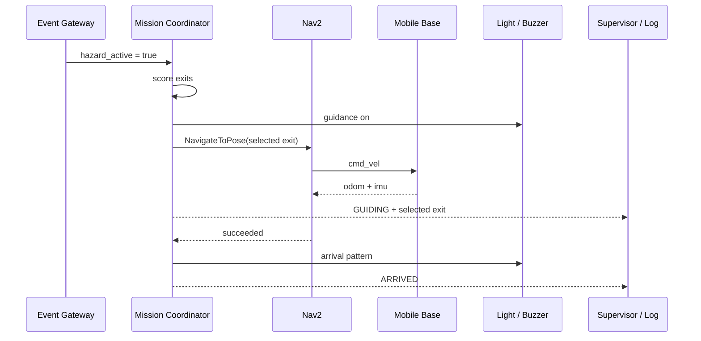

# 应用场景：校园楼宇夜间事件引导

## 场景设定

这是受控实验的场景方案，建筑、坐标和流程不是已完成试点的记录。当前代码从机器人当前位置导航至出口；“先到人员附近集合”需要新增人员关联与集合点导航。

- 场地：两层教学科研楼的一层实验区域；
- 环境：主走廊、支路、门厅、两个出口和若干实验室；
- 时段：夜间低人员密度；
- 机器人任务：日常巡检待命，事件发生后到人员附近并引导至可用出口；
- 事件输入：由实验控制端模拟已经确认的建筑事件；
- 动态因素：行人横穿、推车临时占道、一个出口被封锁。

## 正常流程

## 出口失效流程

1. 当前目标为东出口；
2. 控制端发布 `/hazard/blocked_exits = east`；
3. 任务节点取消当前 Nav2 goal；
4. 东出口进入临时阻塞集合；
5. 重新计算候选出口综合代价；
6. 向西出口发送新目标；
7. 状态日志记录目标与状态变化；Action 细节用 rosbag 记录。新目标只在旧目标终止后发送。

## 故障处理

| 故障 | 检测 | 系统动作 |
| --- | --- | --- |
| `/cmd_vel` 中断 | 350 ms 看门狗 | 底盘零速 |
| 底盘遥测过期 | 300 ms 底盘门控、diagnostics | 拒绝非零速度；监督节点取消任务 |
| 激光扫描过期 | scan heartbeat | `/base/stop=true`，取消任务并进入 `FAULT` |
| 电压低于阈值 | BatteryState | 退出任务并提示充电 |
| Nav2 拒绝目标 | action response | 进入 `FAULT` |
| 当前出口失败 | action result / blocked list | 标记出口并重选 |
| 全部出口不可用 | 候选集合为空 | 进入 `BLOCKED`，保持静止 |

## 演示验收

一次完整演示至少包含：

1. 启动后 `/system/ready=true`；
2. 触发事件并显示所选出口；评分可按配置公式复算；
3. 机器人开始导航并绕开一名横穿人员；
4. 封锁当前出口，机器人取消并切换目标；
5. 到达备用出口并停止；
6. 展示 JSONL 任务日志与 rosbag 时间对齐；
7. 断开一个传感器，验证系统进入不可用状态。

故障后需要解除事件、确认旧目标终止、检查设备，再重新触发。软件联锁不是认证急停；串口完全断开时零速命令无法到达控制器。
