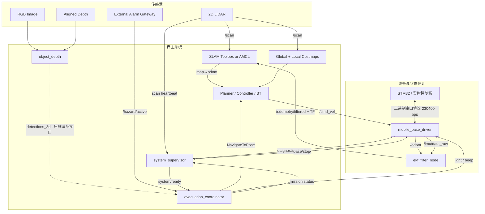

# 系统架构与数据流

## 节点图



## TF 约定

```text
map
└── odom                     AMCL 或 SLAM Toolbox
    └── base_link            robot_localization EKF
        ├── imu_link         URDF fixed transform
        ├── laser_link       URDF fixed transform
        ├── camera_link      URDF fixed transform
        │   └── camera_color_optical_frame
        └── arm_base_link
            └── arm_link_1 ... arm_link_6
```

- `map → odom` 允许因全局定位修正产生跳变；
- `odom → base_link` 必须连续，由 EKF 发布；
- 相机三维检测首先处于 optical frame，任何地图级决策都必须通过 TF2 变换；
- `escape_robot_base` 在 EKF 启用时设置 `publish_tf: false`，避免重复发布 TF。

## 启动组合

| Launch | 组件 | 前置条件 |
| --- | --- | --- |
| `hardware.launch.py` | URDF、底盘驱动、EKF | 实时控制板 串口可用 |
| `mapping.launch.py` | Hardware + SLAM Toolbox | 激光雷达驱动已发布 `/scan` |
| `navigation.launch.py` | Hardware + Nav2 + Guidance + 可选视觉 | 保存的地图、相机/雷达驱动 |
| `simulation.launch.py` | URDF + 全向运动学模拟底盘 | ROS 2 Jazzy，无需机器人硬件 |

## 故障传播原则

1. 设备层错误不被吞掉：串口超时进入 diagnostics，速度看门狗停车。
2. 导航失败不直接重复撞击：当前出口被临时标为不可用，再尝试候选出口。
3. 没有候选出口时保持静止并发布 `BLOCKED`。
4. 感知节点退出不应终止底盘安全控制；导航可以在无视觉扩展时独立工作。
5. 警情解除时取消目标、关闭蜂鸣器和引导灯，回到 `IDLE`。
6. 任务节点发布状态，监督节点聚合底盘、雷达与电源健康并写入事件日志。
7. 监督节点发布运动联锁；底盘收到禁止信号或联锁心跳过期时拒绝非零速度。健康恢复不自动恢复任务。

实线表示当前接入，虚线表示预留扩展。任务节点目前不订阅视觉检测，不自动估计人群密度；距离项采用欧氏距离，不代替 Nav2 可达性判断。`risk_router.py` 的楼宇图路由目前独立验证，尚未接入实时任务。
